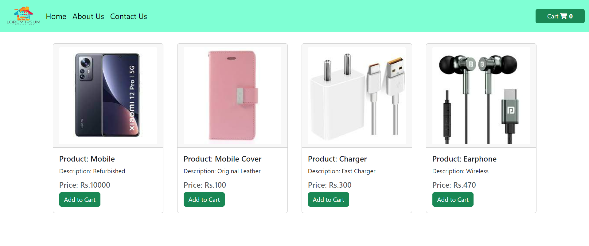

## REACT SHOPPING CART TASK

> Creating a shopping cart using React.js that allows users to add and remove items from shoppig cart

- In the webpage clicking `Add to cart` button in the product card adds the count to the `cart` (right side top).

- After the click `Add to cart` button it changes into `Remove from cart` button.

- On clicking `Remove from cart` button it reduces the count from the `cart` (right side top) and reset itself to `Add to cart` button.

- [Click Here](https://react-shopping-cart-task-chella.netlify.app/) to preview the webpage.

#### Components used in ReactJS

- [Navigation Bar](./src/components/Navbar.jsx) containing Logo, Links and `Cart`.

- [Products](./src/components/Products.jsx) containing datas about products.

- [Product Page](./src/components/ProductPage.jsx) which access products and return as seperate cards.

- [Public](./public/) folder for images that used in the web page.